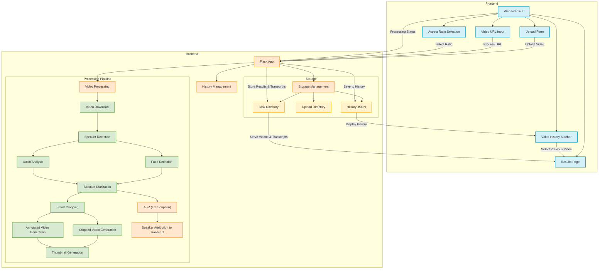

# VoiceVision

An AI-powered smart interview cropping system that detects speakers in videos and automatically focuses on whoever is actively speaking. VoiceVision uses advanced speaker diarization with TalkNet to create perfectly framed videos optimized for social media and presentations. It further enhances videos by generating accurate transcriptions using Whisper ASR, attributing speech segments to the identified speakers, and providing a searchable transcript interface.

## Features

- Real-time speaker detection in videos using audio-visual cues
- Smart cropping that follows active speakers with smooth transitions
- Automatic portrait-mode video generation (9:16) for social media
- Video annotation with speaker information and detection confidence
- Works with multiple speakers in the same video
- Supports various video sources including m3u8 streams
- Video history sidebar for easy access to previously processed videos
- Automatic Speech Recognition (ASR) using Whisper for video transcription.
- Speaker attribution in transcripts, linking spoken segments to detected speakers.
- Searchable transcript interface on the results page for easy content navigation.

## Application Workflow

The diagram below also illustrates the integration of Automatic Speech Recognition (ASR), speaker-to-transcript attribution, and the transcript search functionality.



## Architecture

The application follows a clean 3-layer architecture:

- **UI Layer**: User interfaces for uploading, viewing results, and browsing history
- **Config Layer**: Configuration options for processing parameters
- **Backend Layer**: Core processing logic, storage, and history management

## Getting Started: Running VoiceVision

### Option 1: Using Docker (Recommended)

You can also run the VoiceVision web application using Docker. The official image is available on Docker Hub.

#### Prerequisites

- Docker installed on your system.

#### 1. Pull the Image

Pull the latest image from Docker Hub:

```bash
docker pull mehdih7/voicevision-app:latest
```

#### 2. Run the Container

To run the VoiceVision application, use the following command:

```bash
docker run -d -p HOST_PORT:5001 --name voicevision-container mehdih7/voicevision-app:latest
```

**Explanation:**

*   `-d`: Runs the container in detached mode (in the background).
*   `-p HOST_PORT:5001`: Maps a port on your host machine (`HOST_PORT`) to port `5001` inside the container (where the VoiceVision Flask app listens).
    *   For example, to access the application on `http://localhost:5005` on your host machine, use `-p 5005:5001`.
*   `--name voicevision-container`: Assigns a recognizable name to your running container.
*   `mehdih7/voicevision-app:latest`: Specifies the image to run.

**Example (Accessing on host port 5005):**

```bash
docker run -d -p 5005:5001 --name voicevision-container mehdih7/voicevision-app:latest
```

#### 3. Access the Application

Once the container is running, open your web browser and navigate to:

`http://localhost:HOST_PORT`

(Replace `HOST_PORT` with the port you chose in the `docker run` command).

#### Persisting Data with Volumes (Recommended)

The VoiceVision application creates data in `uploads/` and `task/` directories inside the container. To persist this data if the container is removed, use Docker volumes:

```bash
docker run -d \
  -p HOST_PORT:5001 \
  -v /path/on/your/host/for/uploads:/app/uploads \
  -v /path/on/your/host/for/tasks:/app/task \
  --name voicevision-container \
  mehdih7/voicevision-app:latest
```

**Replace:**
*   `HOST_PORT` with your desired host port (e.g., `5005`).
*   `/path/on/your/host/for/uploads` with the actual path on your computer for uploads (e.g., `$(pwd)/voicevision_data/uploads` to create it in your current project directory).
*   `/path/on/your/host/for/tasks` with the actual path for task data (e.g., `$(pwd)/voicevision_data/tasks`).

Make sure these host directories exist, or Docker might create them with root ownership.

### Option 2: Manual Installation and Execution

#### Requirements

- Python 3.8+
- PyTorch
- OpenCV
- scipy
- python_speech_features
- m3u8
- ffmpeg (command line tool)

#### Installation Steps

1. Clone this repository:
   ```
   git clone https://github.com/mehdih7/VoiceVision.git
   cd VoiceVision
   ```

2. Install dependencies:
   ```
   pip install -r requirements.txt
   ```

3. Download model weights:
   Models should be placed in the `weights/` directory:
   - `talknet_speaker_v1.model`: TalkNet speaker detection model
   - `s3fd_facedetection_v1.pth`: S3FD face detection model

#### Running the Web Application (Development Mode)

   To start the Flask web application locally:
   ```bash
   python app.py
   ```
   The application will then be accessible at `http://localhost:5001`.

### Option 3: Programmatic Usage (as a Python Module)

The core speaker diarization logic can also be imported and used as a Python module in your own scripts:

```python
from demo_speaker_diarization import demo_speaker_diarization

task_id = 'my-interview-task'
video_url = 'https://your-video-url.m3u8'  # Can be a local file too
output_path = f'task/{task_id}/interview_cropped.mp4'

# Generate a cropped video focusing on speakers
demo_speaker_diarization(task_id, video_url, output_path, 
                        target_ratio=(9, 16),  # For portrait mode
                        min_score=0.4)  # Speaker detection threshold
```

## Technical Details

### How It Works

VoiceVision combines face detection, audio analysis, and multi-modal fusion to identify the active speaker in each frame:

1. **Video Processing**: Loads and processes video from various sources
2. **Face Detection**: Detects and tracks faces across video frames
3. **Audio Analysis**: Extracts speech features from the audio track
4. **Speaker Diarization**: Matches audio to visual features to identify active speakers
5. **Transcription**: The audio track is processed by an ASR model (Whisper) to generate a time-stamped transcript.
6. **Speaker Attribution**: The generated transcript is aligned with the speaker diarization output to assign speaker labels to each segment of speech.
7. **Smart Cropping**: Intelligently frames the active speaker with smooth transitions (based on speaker diarization data).
8. **Output Generation**: Creates both a cropped video and an annotated version. The results page also allows searching through the transcript.

### Project Structure

- `demo_speaker_diarization.py`: Main entry point for the module
- `cropper.py`: Smart video cropping around detected speakers
- `components/`: Neural network components
  - `face_detection/`: Face detection module using S3FD
  - `talknet_modules/`: TalkNet speaker detection implementation
  - `encoders/`: Neural network encoders for audio and video
- `weights/`: Model weights directory
- `utils.py`: Utility functions for video processing
- `task/`: Output directory for processed videos

### Model Architecture

The speaker detection is based on TalkNet, which uses both audio and visual cues to detect active speakers in videos. The architecture consists of:

1. Face detection using S3FD
2. Audio feature extraction with a specialized audio encoder
3. Visual feature extraction from detected faces
4. Multi-modal fusion using attention mechanism
5. Speaker activity detection with confidence scores

## License

[MIT License](LICENSE)

## Acknowledgments

- TalkNet for the speaker diarization approach
- S3FD for the face detection model 