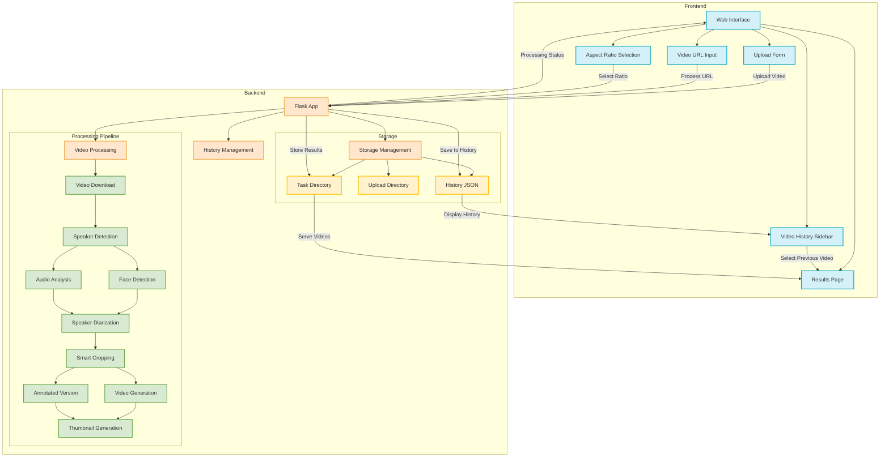

# VoiceVision

An AI-powered smart interview cropping system that detects speakers in videos and automatically focuses on whoever is actively speaking. VoiceVision uses advanced speaker diarization with TalkNet to create perfectly framed videos optimized for social media and presentations.

## Features

- Real-time speaker detection in videos using audio-visual cues
- Smart cropping that follows active speakers with smooth transitions
- Automatic portrait-mode video generation (9:16) for social media
- Video annotation with speaker information and detection confidence
- Works with multiple speakers in the same video
- Supports various video sources including m3u8 streams
- Video history sidebar for easy access to previously processed videos

## Application Workflow



The application follows a clean 3-layer architecture:

- **UI Layer**: User interfaces for uploading, viewing results, and browsing history
- **Config Layer**: Configuration options for processing parameters
- **Backend Layer**: Core processing logic, storage, and history management


## Requirements

- Python 3.8+
- PyTorch
- OpenCV
- scipy
- python_speech_features
- m3u8
- ffmpeg (command line tool)

## Installation

1. Clone this repository:
   ```
   git clone https://github.com/mehdih7/VoiceVision.git
   cd VoiceVision
   ```

2. Install dependencies:
   ```
   pip install -r requirements.txt
   ```

3. Download model weights:
   Models should be placed in the `weights/` directory:
   - `talknet_speaker_v1.model`: TalkNet speaker detection model
   - `s3fd_facedetection_v1.pth`: S3FD face detection model

## Usage

```python
from demo_speaker_diarization import demo_speaker_diarization

task_id = 'my-interview-task'
video_url = 'https://your-video-url.m3u8'  # Can be a local file too
output_path = f'task/{task_id}/interview_cropped.mp4'

# Generate a cropped video focusing on speakers
demo_speaker_diarization(task_id, video_url, output_path, 
                        target_ratio=(9, 16),  # For portrait mode
                        min_score=0.4)  # Speaker detection threshold
```

## How It Works

VoiceVision combines face detection, audio analysis, and multi-modal fusion to identify the active speaker in each frame:

1. **Video Processing**: Loads and processes video from various sources
2. **Face Detection**: Detects and tracks faces across video frames
3. **Audio Analysis**: Extracts speech features from the audio track
4. **Speaker Diarization**: Matches audio to visual features to identify active speakers
5. **Smart Cropping**: Intelligently frames the active speaker with smooth transitions
6. **Output Generation**: Creates both a cropped video and an annotated version

## Project Structure

- `demo_speaker_diarization.py`: Main entry point for the module
- `cropper.py`: Smart video cropping around detected speakers
- `components/`: Neural network components
  - `face_detection/`: Face detection module using S3FD
  - `talknet_modules/`: TalkNet speaker detection implementation
  - `encoders/`: Neural network encoders for audio and video
- `weights/`: Model weights directory
- `utils.py`: Utility functions for video processing
- `task/`: Output directory for processed videos

## Model Architecture

The speaker detection is based on TalkNet, which uses both audio and visual cues to detect active speakers in videos. The architecture consists of:

1. Face detection using S3FD
2. Audio feature extraction with a specialized audio encoder
3. Visual feature extraction from detected faces
4. Multi-modal fusion using attention mechanism
5. Speaker activity detection with confidence scores

## License

[MIT License](LICENSE)

## Acknowledgments

- TalkNet for the speaker diarization approach
- S3FD for the face detection model 